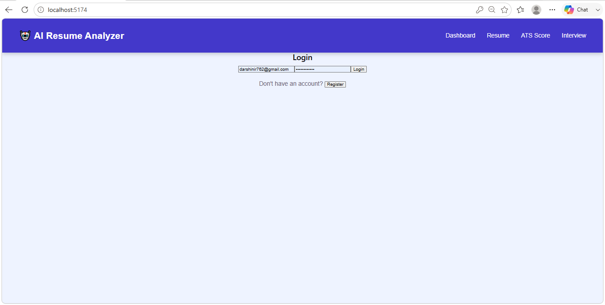
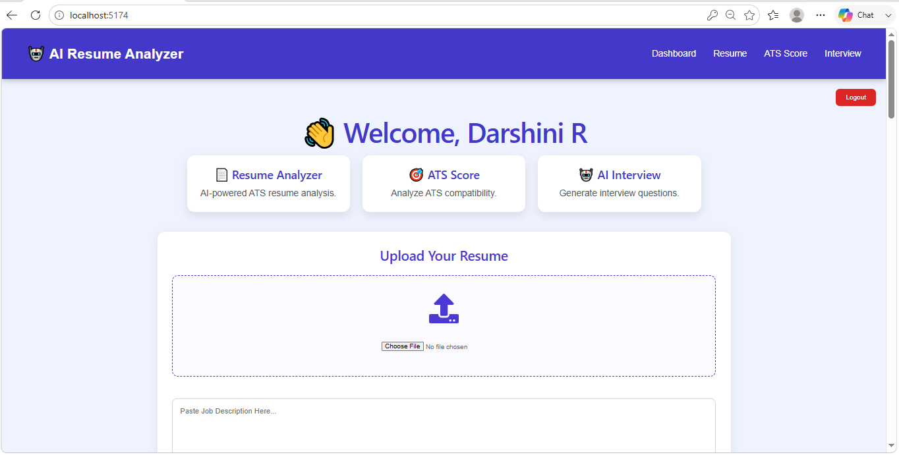
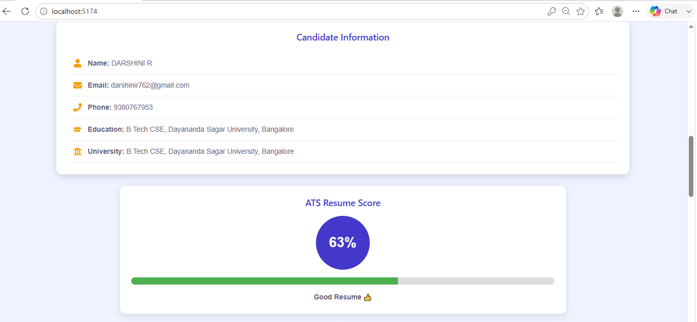
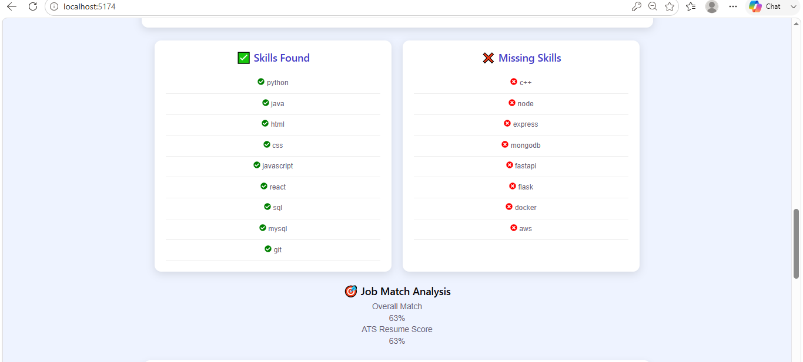
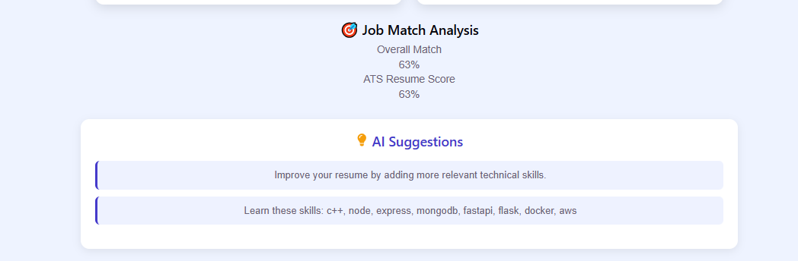
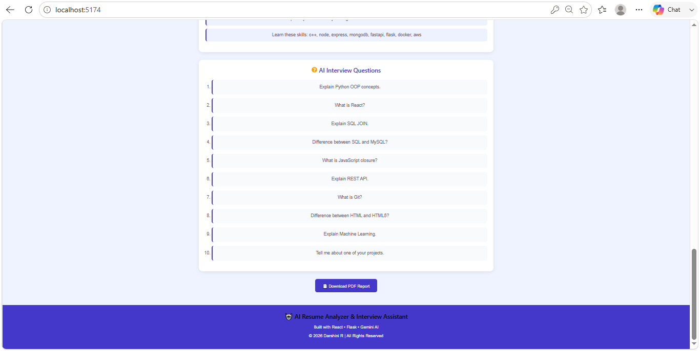

# 🤖 AI Resume Analyzer & Interview Assistant
# 🤖 AI Resume Analyzer & Interview Assistant

## 📌 Overview

AI Resume Analyzer & Interview Assistant is a full-stack web application that helps students and job seekers evaluate their resumes using Artificial Intelligence.

The application allows users to upload a PDF resume, extracts important candidate information, calculates an ATS (Applicant Tracking System) score, identifies matching and missing skills, generates AI-powered interview questions using Google Gemini AI, provides resume improvement suggestions, stores resume history, and allows users to download a PDF report of the analysis.

This project was developed using React.js, Flask, SQLite, SQLAlchemy, and Google Gemini AI.
## ✨ Features

- 🔐 User Authentication (Login & Registration)
- 📄 PDF Resume Upload
- 🧠 Resume Text Extraction
- 👤 Candidate Information Extraction
- 🎯 ATS Score Calculation
- 📊 Skills Analysis (Matched & Missing Skills)
- 💡 AI Resume Improvement Suggestions
- 🤖 AI Interview Question Generator using Google Gemini AI
- 📁 Resume History
- 📥 PDF Report Download
- 📱 Responsive User Interface
## 🛠️ Tech Stack

### Frontend
- React.js
- JavaScript (ES6+)
- HTML5
- CSS3
- Axios

### Backend
- Flask
- Python
- Flask-CORS
- Flask-SQLAlchemy
- Flask-Bcrypt

### Database
- SQLite

### Artificial Intelligence
- Google Gemini AI API

### Libraries & Tools
- pdfplumber
- jsPDF
- Vite
- Git
- GitHub
## 📸 Application Screenshots

### 🔐 Login Page



---

### 🏠 Dashboard



---

### 📊 ATS Score



---

### 📂 Resume History


---

### ✅ Skills Analysis



---

### 💡 AI Suggestions



---

### 🤖 AI Interview Questions


## 🚀 Installation

### 1. Clone the Repository

```bash
git clone https://github.com/YOUR_USERNAME/ai-resume-analyzer.git
```

### 2. Open the Project

```bash
cd ai-resume-analyzer
```

### 3. Install Frontend Dependencies

```bash
npm install
```

### 4. Start React Frontend

```bash
npm run dev
```

### 5. Open Backend

```bash
cd backend
```

### 6. Install Python Dependencies

```bash
pip install -r requirements.txt
```

### 7. Create Environment File

Create a file named `.env`

```env
GEMINI_API_KEY=YOUR_GEMINI_API_KEY
```

### 8. Run Backend

```bash
python app.py
```

Frontend:
http://localhost:5173

Backend:
http://127.0.0.1:5000


## 📂 Project Structure

```
ai-resume-analyzer
│
├── backend
│   ├── app.py
│   ├── auth.py
│   ├── ats.py
│   ├── database.py
│   ├── gemini.py
│   ├── parser.py
│   ├── requirements.txt
│   └── uploads
│
├── screenshots
│
├── src
│   ├── components
│   ├── assets
│   ├── hooks
│   ├── services
│   ├── styles
│   ├── utils
│   ├── App.jsx
│   └── main.jsx
│
├── public
├── package.json
└── README.md
```
## 🚀 Future Enhancements

- AI Cover Letter Generator
- Resume Ranking System
- Resume Comparison
- Dark Mode
- Email Report Sharing
- Multi-language Support
- Cloud Database Integration
- Resume Templates
- Job Recommendation System

## 👨‍💻 Author

**Darshini R**

- GitHub: https://github.com/darshini762-commits
- LinkedIn: https://www.linkedin.com/in/darshini-rangaswamy-6a7b8a37

